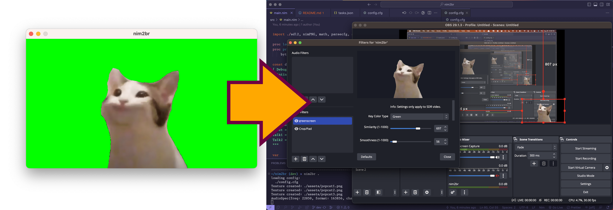

# nim2br



the simplest possible program for PNGTubing!

under 200 LOC!

under 150 SLOC!

no features!

fuck you!

## dependencies

SDL2, nimPNG

## how to build

```bash
nim c -o:nim2br -d:release --app:gui src/main
```

## how to install

```bash
cp nim2br /usr/local/bin
```

## how to use

```bash
nim2br [dir]
```
